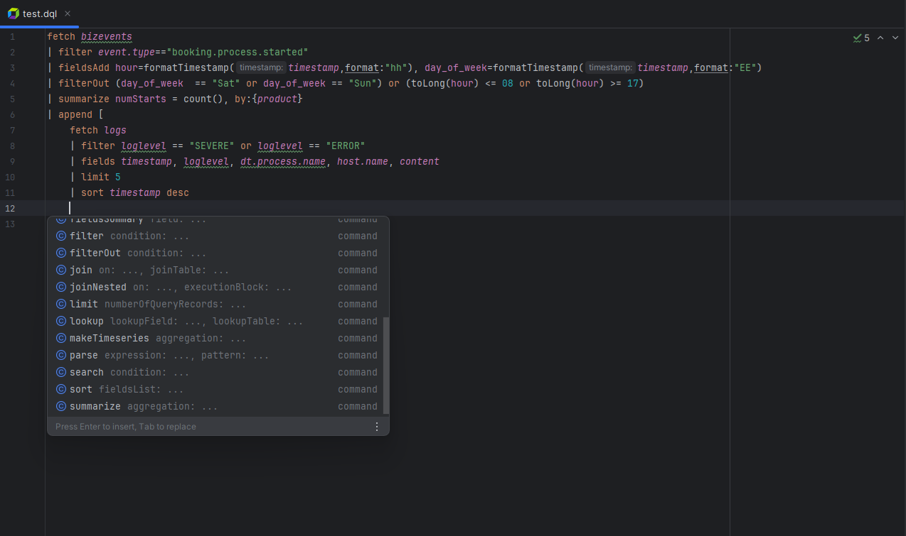
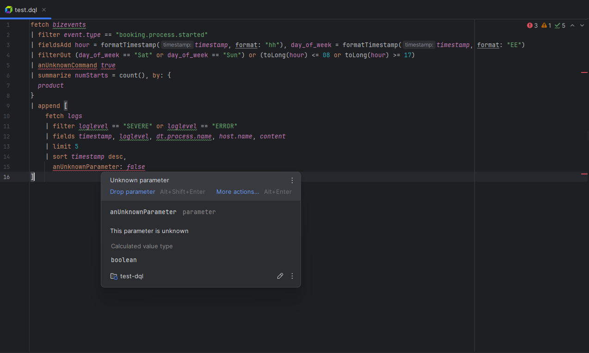
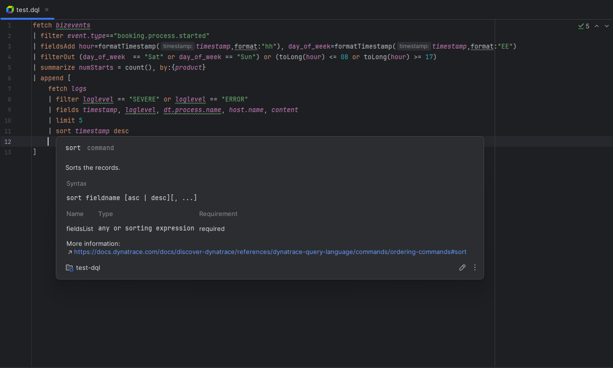

# intellij-idea-dql

This repository contains the plugin adding support for
[Dynatrace Query Language (DQL)](https://docs.dynatrace.com/docs/discover-dynatrace/references/dynatrace-query-language)
in IntelliJ IDEA.

> **Note**
> This product is not officially supported by Dynatrace

This is an *unofficial* plugin offering tools for effective writing of DQL files. It offers similar functionality
to the Dynatrace Notebooks, but can work fully locally.

In the **full-local mode**, the plugin does not know any field-related context: it does not know which fields
are available in `logs` or metrics, so it **cannot validate the whole query** as well as Dynatrace Notebooks can.

When **a connection to the Dynatrace tenant is configured**, the plugin can execute DQL scripts and show the results.
It can also use the connection to show any kind of validation offered by Dynatrace Notebooks.

The plugin **does not aim to replace Dynatrace Notebooks** - it should still be your primary choice when writing DQLs!
The main goal is to provide a good enough environment to work within IntelliJ when storing your DQLs in Git.
In the local-only mode, it does not have nearly as many validations as the real notebook environment,
so valid DQL queries written using the plugin can still be invalid after executing them on Notebooks
(although errors should be rather minor).

## Features

### DQL customization

The plugin offers advanced and *customizable syntax highlighting* - within the code style settings page you can change
most of the colors used for DQL tokens and keywords.

The plugin also provides a lot of code style settings related to indents, spaces and line breaks between DQL tokens.
You will now be able to ensure a common style for all `.dql` files stored in your repository.

As a bonus, the plugin also adds support for IntelliJ _inlays_ for unnamed parameters, so it is now much easier to
see which values belong to which parameter.

### Detecting references

The plugin uses IntelliJ references to provide relations between **DQL fields, functions, statements,
and parameters**. You can find usages of a specific field and see where in the query the value was set.
There is also **support for code refactoring**, which makes it straightforward to - for example -
change a field name everywhere at once.

### Code completion

Depending on the context of the DQL query, the completion contributor will show you available
options. It works with:

- **DQL Commands**, with distinction for query-starting commands and operations on the data set.
- **Statement parameters**, with automatically fulfilling their default values.
- **DQL fields** - You'll see all fields used in the query, and if the field's value was overwritten.
  It will also show the value within the completion tooltip.
- **DQL functions and their parameters**, with automatically filtering out functions that do not provide a proper
  return value for the current context.
- **DQL subqueries**, for commands offering joining functionality.

### DQL functions support

The plugin contains the list of **all supported DQL functions**.

Unfortunately, because Dynatrace does not offer any REST API returning the list, it is scraped from the documentation
page, making it possible to not have the latest-available set of functions. In case of using such an unknown function,
the plugin will produce a weak warning but ignore its return values and parameters set.

### Contextual issues detection

Apart from just validating the DQL file syntax, the plugin is also automatically detecting contextual
issues and - where possible - offering a quick fix to resolve them. It can detect:

- Invalid commands
- Invalid command parameters: invalid names and values, missing and duplicated parameters, conflicts with other
  parameters.
- Invalid parameters for functions (also recursively checking if the function return value matches the required
  parameter type)
- Other smaller issues like static values being used in expressions or not-constant values provided where they are
  required

The plugin **does not have** any validations related to field values because it does not connect to Dynatrace to get
metadata.

### Documentation tooltips

You can hover over query parts to see more information about the element. The information is taken from the Dynatrace
documentation page.

- DQL command documentation: description, list of available parameters
- DQL functions documentation: description, syntax, list of available parameters, return values
- Parameters documentation (for statements and functions): description, possible values
- Context information for other elements, like DQL fields, variables, boolean types, etc.

The plugin also implements structure with navbar for IntelliJ, so it's very easy to track the context of the query.

### Partial DQL support

If you store your DQLs in smaller chunks (and dynamically stitch them together), the query can report many errors due
to the syntax not being properly validated.

For such cases, you can rename your file to `*.partial.dql` to use a much more relaxed syntax parsing, where you can:

1. Start a query with a `|`
2. Start a query with a command that would not normally be correct, like `summarize`.

### DQL execution on a specific tenant

The plugin adds support for Run Configurations allowing the user to execute the DQL file on a specified Dynatrace
tenant.
The results of the query execution will be presented as a table, allowing you to quickly verify if the written query
returns the correct data.

### Live validations

If enabled, the plugin can execute external validations using Dynatrace REST API, showing you any kind of errors
Dynatrace Notebooks could.

By default, the feature is disabled, as it requires an authenticated connection to a Dynatrace tenant, which can be done
in the plugin's settings.

## Configuring connection to the Dynatrace tenant

The plugin allows providing a way to connect to a Dynatrace tenant. Apart from the tenant URL, you'll need to specify
the authentication method.

Currently, the only way of authentication is providing a token. You can see more about that
[in the official docs](https://docs.dynatrace.com/docs/discover-dynatrace/references/dynatrace-api/basics/dynatrace-api-authentication).
By default, the token should include the `storage:buckets:read`, but you will also need to add permissions to the
specific data types, like: `storage:logs:read`, `storage:spans:read`, or `storage:bizevents:read`.

## Building

This plugin uses the [GrammarKit](https://github.com/JetBrains/Grammar-Kit/tree/master) plugin to generate all
necessary PSI resources.
You'll need to generate them for both `.flex` and `.bnf` files from the [grammar](src/main/grammar)package.

