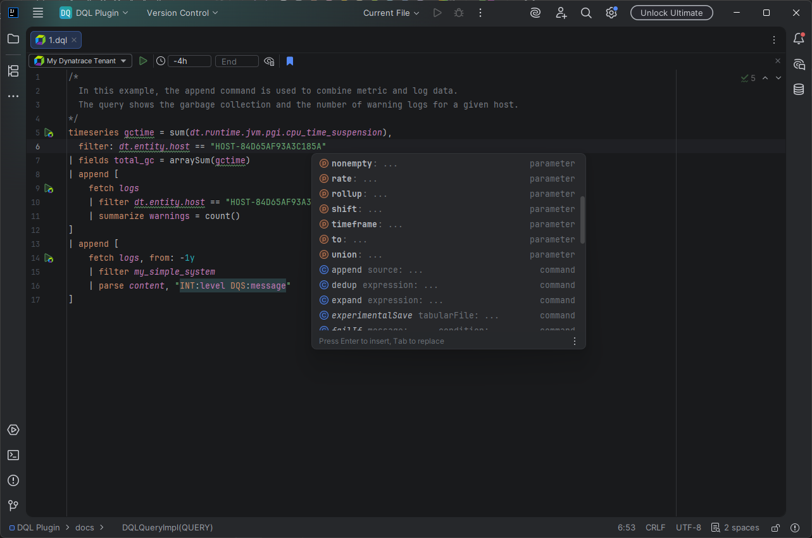
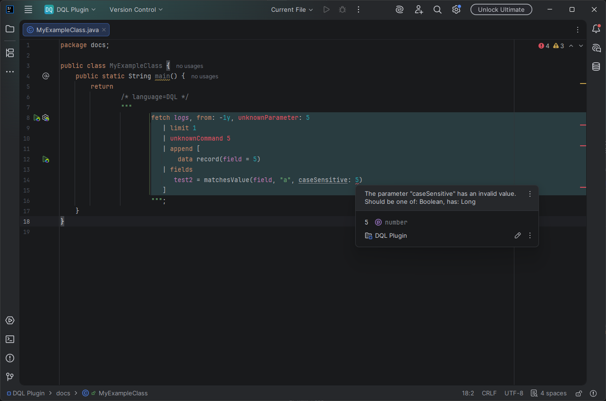

# Dynatrace Query Language

The plugin adds support of
the [Dynatrace Query Language (DQL)](https://docs.dynatrace.com/docs/discover-dynatrace/references/dynatrace-query-language)
inside the `.dql` files.

## Features

> ℹ️ Some of the features added to the plugin will only work **when a connection to a Dynatrace tenant is configured**.
> You can find such information in the description of such feature.

### Code style settings

The plugin adds a support for customizing the DQL code style. You can find the settings under a dedicated page in
`Settings` > `Editor` > `Code Style` > `Dynatrace Query Language`.

Apart from the formatting the DQL code itself, the plugin also will ensure that the comments used in the query
and language injected into strings (like JSON or DPL blocks) will follow the configured style.

### Custom color scheme

The color scheme used for DQL files can be customized in `Settings` > `Editor` > `Color Scheme` >
`Dynatrace Query Language`.

Additionally to the DQL query itself, the plugin will also display the dedicated highlighting for languages injected
into strings (like JSON or DPL blocks).

As a bonus, the plugin also adds support for IntelliJ *inlays* for unnamed parameters, so it will be much easier to
see which values belong to which parameter.

### Code completion

Depending on the context of the DQL query, the completion contributor will show you available
options. It works with:

- **DQL Commands**, with distinction for query-starting commands and operations on the data set.
- **Statement parameters**, with automatically fulfilling their default values.
- **DQL fields** — You'll see all fields used in the query, and if the field's value was overwritten.
  It will also show the value within the completion tooltip.
- **DQL functions and their parameters**, with automatically filtering out functions that do not provide a proper
  return value for the current context.
- **DQL subqueries**, for commands offering to join functionality.

After enabling the connection to a Dynatrace tenant, the plugin can also fetch the list of available fields and data
objects from Grail. This feature can be toggled via the `Settings` > `Tools` > `Dynatrace Query Language` ->
`Use Dynatrace autocomplete to suggest query fields` option.



### Inspections

The plugin adds a lot of fully local inspections, verifying the DQL syntax and context without the need to connect to
a Dynatrace tenant. You can configure which issues should be reported by the plugin inside the `Settings` > `Editor` >
`Inspections` > `Dynatrace Query Language` view.

While those inspections cover most of the common issues, not everything can be verified locally without the knowledge
of the data stored on the tenant. Because of that, if the connection to a Dynatrace tenant is configured, the plugin
will also execute background verification of the DQL statements on the tenant, showing essentially the same results
as Dynatrace Notebooks. This feature can be toggled via the `Settings` > `Tools` > `Dynatrace Query Language` ->
`Perform live validation on Dynatrace tenant` option.



### Intentions

The list of supported intentions is available in the `Settings` > `Editor` >
`Intentions` > `Dynatrace Query Language` view.

### On-hover documentation

You can hover over almost any query parts to see more information about the element.

The plugin also implements structure with navbar for IntelliJ, so it's straightforward to track the context of the
query.


### Field references

The plugin uses IntelliJ references to provide relations between DQL fields. You can find usages of a specific field and
see where in the query the value was set.
There is also support for code refactoring, which makes it straightforward to — for example —
change a field name everywhere at once.

### Dynatrace Dashboards variables

Dynatrace Dashboards allow the user to specify global variables that can be injected into DQL queries.
Unfortunately, those variable expressions are not supported outside Dynatrace Dashboards, making the written DQL query
always fail with the `$` usage error. Because the Dynatrace REST API can only return a single error, this would mean
that expressions defined after the variable would not be reported as errors, rendering the validation very limited.

As a solution for the problem, the plugin allows specifying variable placeholders in a special file named
`dql-variables.json`. If the placeholder for the variable was defined, it will be replaced with it before sending the
DQL query to the tenant, otherwise the variable will be replaced with a `null` value.

The plugin will load the `dql-variables.json` file from the directory containing the DQL file being edited, then from
a parent directory, and so on, until the project root. This way you can define common variables shared by DQL queries
in a single place, while still being able to override them in subdirectories.

#### Variable file format

The `dql-variables.json` file should contain a JSON object, where the keys are variable names (without the `$` sign),
and the values are the placeholders to be used in the DQL query:

- strings will be injected as DQL strings
- numbers will be injected as DQL numbers
- booleans will be injected as DQL booleans
- `null` values will be injected as DQL `null` values
- arrays will be converted to the DQL `array` command, supporting nested objects
- objects will be converted to the DQL `record` command, supporting nested objects

In some cases, you might want to inject a DQL fragment as-is, without any quoting or conversion. For such cases, you can
specify a JSON object with a `$type: dql` and `dql: INJECTED_DQL_FRAGMENT` properties. See the example below for
reference.

#### Example configuration

Given the following `dql-variables.json` file:

```json
{
  "number": 42,
  "string": "Hello, World!",
  "boolean": true,
  "nullValue": null,
  "array": [
    1,
    {
      "nested": "object"
    }
  ],
  "object": {
    "key": "value"
  },
  "dqlFragment": {
    "$type": "dql",
    "dql": "now() - 7d"
  }
}
```

and the following DQL query:

```text
data record(
  number = $number,
  string = $string,
  boolean = $boolean,
  nullValue = $nullValue,
  array = $array,
  object = $object,
  dqlFragment = $dqlFragment
)
```

will result with the following DQL query being parsed:

```dql
data record(
  number = 42.0,
  string = "Hello, World!",
  boolean = true,
  nullValue = null,
  array = array(1.0, record(nested = "object")),
  object = record(key = "value"),
  dqlFragment = now() - 7d
)
```

### Query execution

When a Dynatrace tenant connection is configured, you can execute DQL queries directly from the IDE.


#### DQL query selection

You can select a part of the DQL query to be executed. If the plugin discovers a part of the query is selected, a popup
menu will appear asking the user to confirm whether to execute the whole query or only the selected part.
The text selection will be automatically expanded to cover the whole commands, to avoid executing incomplete DQL query
which would always fail.

If the editor caret is placed inside a DQL subquery (e.g., inside a `join` command), the plugin will also offer to
execute only the subquery.

#### Query configuration toolbar

Each opened `.dql` file will have a dedicated toolbar displayed at the top part of the editor. The visibility of the
toolbar can be toggled in the `Settings` > `Tools` > `Dynatrace Query Language` >
`Show DQL execution toolbar for DQL files` option.

Apart from executing the DQL query, the toolbar also allows to provide the query configuration context to the execution.
You can select the Dynatrace tenant that should be used and provide additional Dynatrace options.

#### Gutter icons

By default, the plugin shows gutter icons for DQL queries:

- **Execute DQL** — starts the execution of the DQL query in the editor. It is automatically displayed for the first
  statement (like `fetch`), executing the whole query, and for all subqueries (like `join` commands), executing only the
  nested query fragment.
- **Configure DQL query** - opens the DQL query configuration toolbar for DQL queries injected into other languages,
  allowing the user to provide the execution context.

You can toggle gutter icons visibility by right-clicking the gutter area and selecting the `Configure Gutter Icons...`
option and searching for the `Dynatrace Query Language` section.

#### Run configurations

By default, the provided DQL execution context is stored only in the memory and is lost when the IDE is closed.
To ensure the configuration for the DQL query is persisted between IDE restarts, you can create a Run Configuration
for the DQL file, providing the same options as in the execution toolbar. Clicking the `Save As Run Configuration`
button in the execution toolbar will create such configuration automatically.

You can also create a Run Configuration without the relation to a DQL file by providing an exact DQL query to be
executed. This way you can create reusable DQL queries that can be executed from the `Run` menu, possibly sharing them
with your team by storing the Run Configuration in the Git repository.

#### DQL execution result

After executing the DQL query on a selected Dynatrace tenant, the plugin will display the result in the `Services` tab.
By default, the returned records are displayed in a tabular format, but you can also switch into a JSON view, supporting
folding regions and syntax highlighting. You can also show details about the query execution: display the DQL query or
the query metadata (details like execution time, number of returned records, etc.), and open results as a table in a new
editor tab. Additionally, you can save the JSON result into a file.

Inside the tabular view, double-clicking a cell will open its content in a new editor tab, allowing you to explore
complex values like nested records or long strings easily. You can change the order and visibility of displayed columns
by clicking on the option button in the toolbar.

In case when the DQL query execution fails, the plugin will display the error message returned by the Dynatrace tenant.

If Dynatrace returns notifications about the executed query (like a warning about limited records number), they will be
displayed at the bottom part of the result view.

#### Query console

The plugin also adds support for executing DQL queries without the need of creating a `.dql` file.
The console can be opened via the `Tools` -> `Services` -> `Dynatrace Query Console` menu or by clicking the `+` button
in the `Services` tab.

### Partial DQL

In some cases (especially when storing DQLs as-a-code in your repository) you might want to create DQL files containing
the most common parts of statements and include them into other DQL files.

This most probably will mean that one of those files will not be a valid DQL by itself, as it will not start with
a data source command like `fetch`.

You can store smaller parts of DQL queries in dedicated sublanguages:

- [Expressions DQL](./DQL-Expression.md) - specify only expressions without the DQL command context
- [DQL Part](./DQL-Part.md) - specify DQL command usages without the need to follow the full DQL syntax rules
